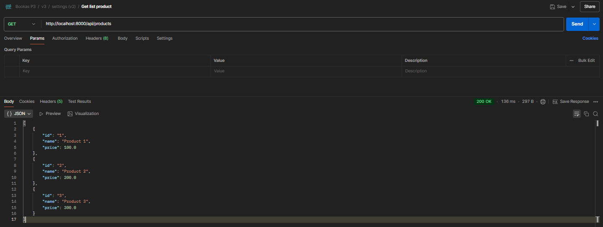
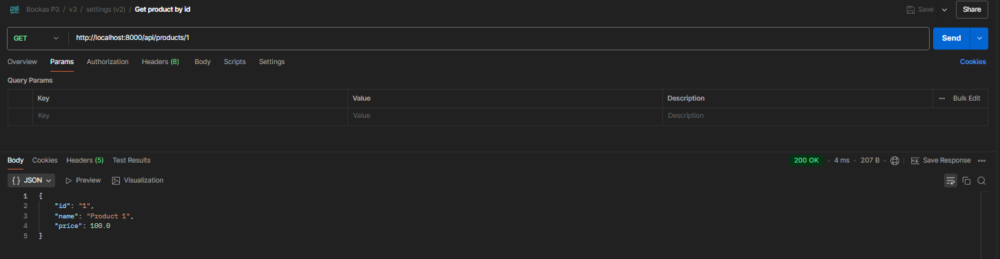
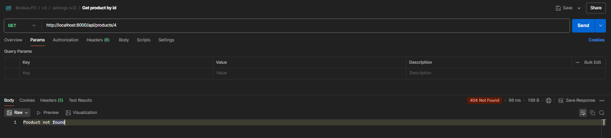
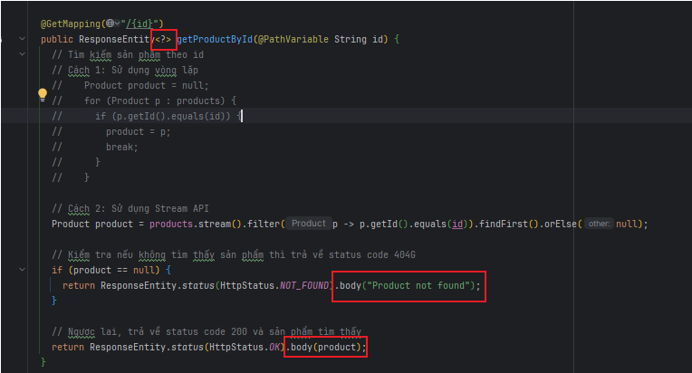
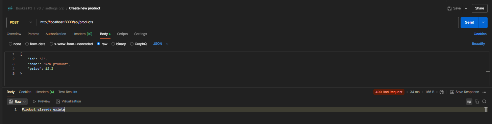
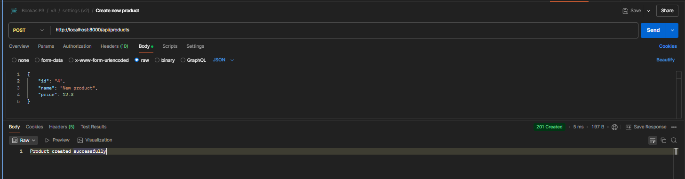
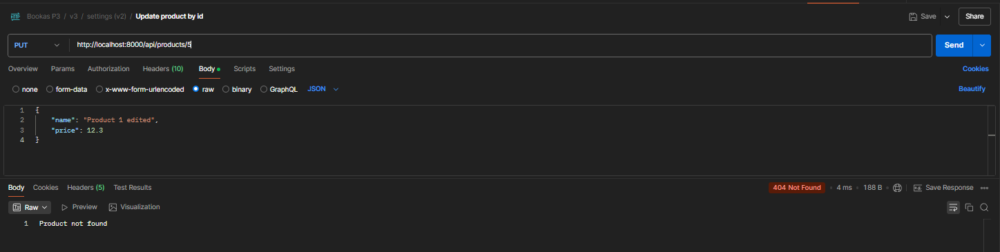
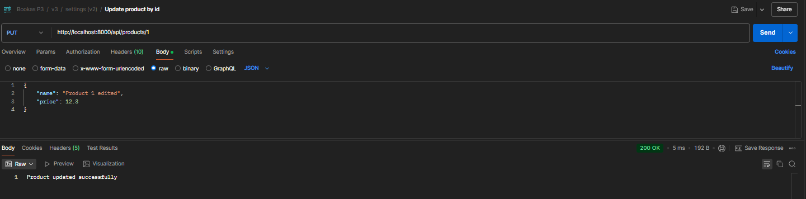
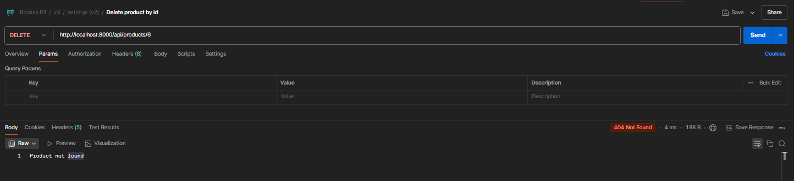
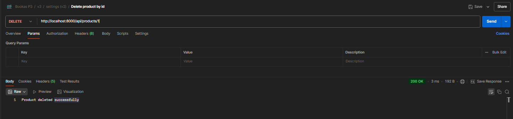

## 1. API get list product

## 2. API get product by id
- Success get

- Not found

- Khi có nhiều hơn một loại dữ liệu trả về (Ví dụ bên dưới là 2 loại String và Product) thì trong data type của ResponseEntity sẽ để dấu '?'

## 3. API create product
- Tạo với id đã tồn tại

- Tạo thành công

## 4. API update product
- Update với id không tồn tại

- Update thành công

## 5. API delete product
- Xóa với id không tồn tại

- Xóa thành công

